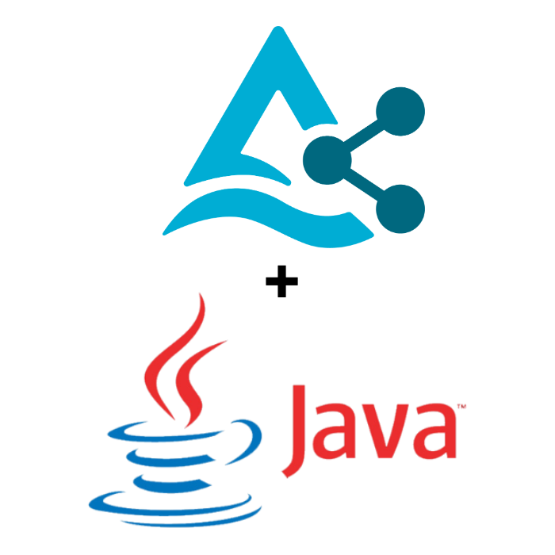

# Delta Sharing Java Connector

A Java connector for [Delta Sharing](https://delta.io/sharing/) that allows you to easily ingest data on any JVM.

## Project Description
This project brings Delta Sharing capabilities to Java.

The Java connector follows the Delta Sharing protocol to read shared tables from a Delta Sharing Server. To further reduce and limit egress costs on the Data Provider side, we implemented a persistent cache to reduce and limit the egress costs on the Data Provider side by removing any unnecessary reads.

- The data is served to the connector via persisted cache to limit the egress costs whenever possible.
  - Instead of keeping all table data in memory, we will use file stream readers to serve larger datasets even when there isn't enough memory available.
  - Each table will have a dedicated file stream reader per part file that is held in the persistent cache. File stream readers allow us to read the data in blocks of records and we can process data with more flexibility.
  - Data records are provided as a set of Avro GenericRecords that provide a good balance between the flexibility of representation and integrational capabilities. GenericRecords can easily be exported to JSON and/or other formats using EncoderFactory in Avro.

- Every time the data access is requested the connector will check for the metadata updates and refresh the table data in case of any metadata changes.
   - The connector requests the metadata for the table based on its coordinate from the provider. The table coordinate is the profile file path following with `#` and the fully qualified name of a table (`<share-name>.<schema-name>.<table-name>`)
   - A lookup of table to metadata is maintained inside the JVM. The connector then compares the received metadata with the last metadata snapshot. If there is no change, then the existing table data is served from cache. Otherwise, the connector will refresh the table data in the cache.
  
- When the metadata changes are detected both the data and the metadata will be updated.
  - The connector will request the pre-signed urls for the table defined by the fully qualified table name. The connector will only download the file whose metadata has changed and will store these files into the persisted cache location.

In the current implementation, the persistent cache is located in dedicated temporary locations that are destroyed when the JVM is shutdown. This is an important consideration since it avoids persisting orphaned data locally.

## Project Support
Please note that all projects in the /databrickslabs github account are provided for your exploration only, and are not formally supported by Databricks with Service Level Agreements (SLAs).  They are provided AS-IS and we do not make any guarantees of any kind.  Please do not submit a support ticket relating to any issues arising from the use of these projects.

Any issues discovered through the use of this project should be filed as GitHub Issues on the Repo.  They will be reviewed as time permits, but there are no formal SLAs for support.

## Building the Project
The project is implemented on top of maven.
To build the project locally:
- Make sure you are in the root directory of the project
- Run `mvn clean install`
- The jars will be available in /target directory

## Using the Project
To use the connector in your projects use maven coordinates with desired version.