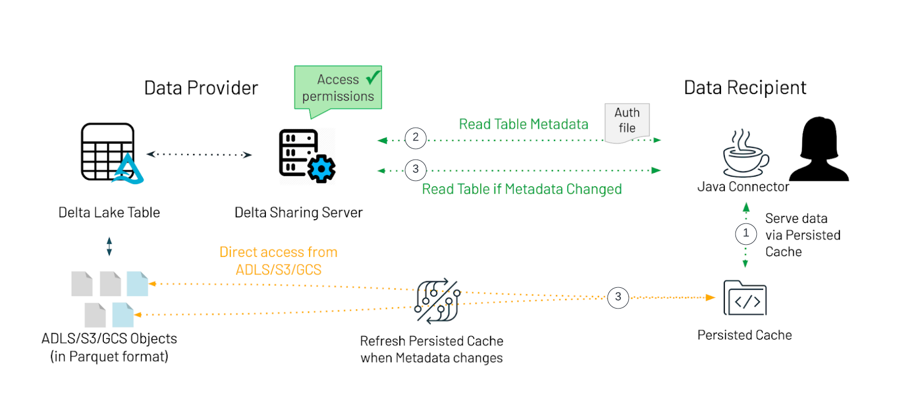

.. delta-sharing-java-connector documentation master file, created by
   sphinx-quickstart on Wed Feb  2 11:01:42 2022.
   You can adapt this file completely to your liking, but it should at least
   contain the root `toctree` directive.

.. image:: images/delta-sharing-java-logo.png
   :width: 10%
   :alt: delta-sharing-java-connector
   :align: left

delta-sharing-java-connector is an extension to the `delta sharing <https://delta.io/sharing/>`__ that allows easy and simple ingestion of delta sharing tables in java applications.

delta-sharing-java-connector provides:
   - simple to use APIs;
   - local caching of remote files to limit egress/ingress costs;
   - readers based on a round robin streams to limit runtime memory requirements;

Since this is a java connector, all APIs can be used from either java or scala.
The intended usage of the connector is to provide connectivity to remote data hosted on delta sharing
from JVM based applications that may run only on a single node.

Note: the code does depend on spark binaries but does not require spark service running at serving time.

Documentation
=============

.. toctree::
   :maxdepth: 1
   :caption: Contents:

   provider/json
   usage/DeltaSharing
   usage/TableReader

Indices and tables
==================

* :ref:`genindex`
* :ref:`search`

.. * :ref:`modindex`

Project Support
===============

Please note that all projects in the ``databrickslabs`` github space are provided for your exploration only, and are not formally supported by Databricks with Service Level Agreements (SLAs). They are provided AS-IS and we do not make any guarantees of any kind. Please do not submit a support ticket relating to any issues arising from the use of these projects.

Any issues discovered through the use of this project should be filed as GitHub Issues on the Repo. They will be reviewed as time permits, but there are no formal SLAs for support.
